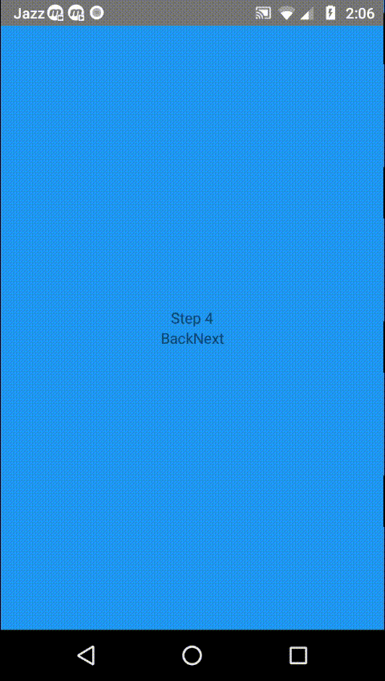

# React Native Animated Multistep

## Preview



## installation

You can install this package with the following command:

`yarn add react-native-animated-multistep`

or

`npm install react-native-animated-multistep`

## How to use

you can also see this [example](https://github.com/samad324/react-native-multistep-example)

### In the top level component add

```js
import AnimatedMultistep from "react-native-animated-multistep";

/* Define the steps  */

import Step1 from "./steps/step1";
import Step2 from "./steps/step2";
import Step3 from "./steps/step3";
import Step4 from "./steps/step4";

const allSteps = [
  { name: "step 1", component: Step1 },
  { name: "step 2", component: Step2 },
  { name: "step 3", component: Step3 },
  { name: "step 4", component: Step4 }
];

/* Define your class */
export default class App extends Component {
  /* define the method to be called when you go on next step */

  onNext = () => {
    console.log("Next");
  };

  /* define the method to be called when you go on back step */

  onBack = () => {
    console.log("Back");
  };

  /* define the method to be called when the wizard is finished */

  finish = finalState => {
    console.log(finalState);
  };

  /* render MultiStep */
  render() {
    return (
      <View style={{ flex: 1 }}>
        <AnimatedMultistep
          steps={allSteps}
          onFinish={this.finish}
          onBack={this.onBack}
          onNext={this.onNext}
          comeInOnNext="bounceInUp"
          OutOnNext="bounceOutDown"
          comeInOnBack="bounceInDown"
          OutOnBack="bounceOutUp"
        />
      </View>
    );
  }
}
```

### In the step

```js
import React, { Component } from "react";
import { Image, View, TouchableOpacity, TextInput, Text } from "react-native";

import styles from "./styles";

class step1 extends Component {
  constructor(props) {
    super(props);
    this.state = {
      totalSteps: "",
      currentStep: ""
    };
  }

  static getDerivedStateFromProps = props => {
    const { getTotalSteps, getCurrentStep } = props;
    return {
      totalSteps: getTotalSteps(),
      currentStep: getCurrentStep()
    };
  };

  nextStep = () => {
    const { next, saveState } = this.props;
    // Save state for use in other steps
    saveState({ name: "samad" });

    // Go to next step
    next();
  };

  goBack() {
    const { back } = this.props;
    // Go to previous step
    back();
  }

  render() {
    const { currentStep, totalSteps } = this.state;
    return (
      <View style={[styles.container, styles.step1]}>
        <View>
          <Text
            style={styles.currentStepText}
          >{`Step ${currentStep} of ${totalSteps}`}</Text>
        </View>
        <TextInput
          style={styles.input}
          onChangeText={text => this.setState({ text })}
          value={this.state.text}
          placeholder={"First Name"}
          placeholderTextColor="#fff"
        />
        <TextInput
          style={styles.input}
          onChangeText={text => this.setState({ text })}
          value={this.state.text}
          placeholder={"Last Name"}
          placeholderTextColor="#fff"
        />
        <View style={styles.btnContainer}>
          <TouchableOpacity onPress={this.nextStep} style={styles.btnStyle}>
            <Image
              source={require("../assets/icons/arrow.png")}
              style={styles.btnImage}
              resizeMode="cover"
            />
          </TouchableOpacity>
        </View>
      </View>
    );
  }
}

export default step1;
```

## API

### this.props.saveState({ key: value, key2: value2})

Use this method to save state

### this.props.resetState()

Use this method to reset state

### this.props.getState()

Use this method to get all the values saved with saveState so far. Retuns an object

### this.props.next()

Use this method to go to next step in the app.

### this.props.back()

Use this method to go to previos step in the app.

### this.props.getCurrentStep()

Use this method to get current step.

### this.props.getTotalSteps()

Use this method to get total steps.

### Props

| Props        | Type       | Notes                                                                                    | Required |
| ------------ | ---------- | ---------------------------------------------------------------------------------------- | -------- |
| steps        | `Array`    | array containing steps                                                                   | ✔️       |
| onFinish     | `function` | a function, which will run when all steps are finish                                     | ❌       |
| onNext       | `function` | a function, which will run when you go on next step                                      | ❌       |
| onBack       | `function` | a function, which will run when you go on back step                                      | ❌       |
| comeInOnNext | `String`   | define you animation type when the component comes in on next, default is `fadeInLeft`   | ❌       |
| OutOnNext    | `String`   | define you animation type when the component goes out on next, default is `fadeOutRight` | ❌       |
| comeInOnBack | `String`   | define you animation type when the component comes in on back, default is `fadeInRight`  | ❌       |
| OutOnBack    | `String`   | define you animation type when the component goes out on next, default is `fadeOutLeft`  | ❌       |
| duration    | `number`   | define you animation duration `duration`  | ❌       |
| defaultState   | `Object`   | define your default state to use across the steps, default is `empty`   | ❌       |

### Note:

you can add more animation and set-up animations by your own, check [react-native-animatable](https://github.com/oblador/react-native-animatable#animatableexplorer-example) for aminations.

### Methods

| Method Name        | Arguments | Notes                                                              |
| ------------------ | --------- | ------------------------------------------------------------------ |
| `next()`           | `none`    | use this method to jump on next step                               |
| `back()`           | `none`    | use this method to go back on previous step                        |
| `saveState()`      | `Object`  | use this method to save your state, in order to get in other steps |
| `resetState()`  | `none`    | use this method to for reset state                          |
| `getState()`       | `none`    | use this method to get you saved state by `saveState()` method     |
| `getCurrentStep()` | `none`    | use this method to get current step                                |
| `getTotalSteps()`  | `none`    | use this method to get total steps                                 |
